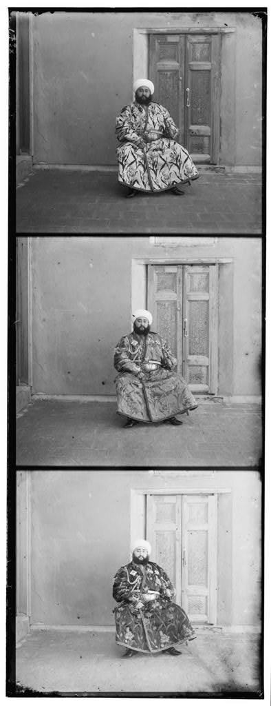

# RGB-Alignment
Colorizing Prokudin-Gorskii images

This is a course project for CS 543 Computer Vision. It divides the image into three equal parts (channels) and align two of the channels to the third.

Some example output:

  
  

  
  

